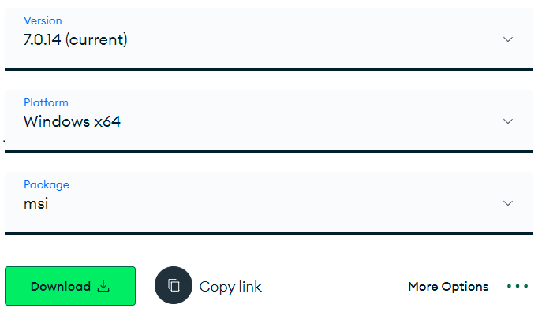

<h1 style="text-align:center; font-size:3em; color:#4CAF50;">🍽️ Time To Order</h1>

    Welcome to <strong>Time To Order</strong> – a website that makes ordering food more convenient and helps organize ordering information easily.

<h2 style="color:#4CAF50;">🔍 Features</h2>
<ul style="font-size:1.1em; line-height:1.8em;">
    <li>Effortlessly create menus.</li>
    <li>Utilize OCR to extract menu items from images.</li>
</ul>

<h2 style="color:#4CAF50;">⚙️ Setup</h2>

<h3 style="color:#FF9800;">1. Build Google OAuth User ID</h3>

    Visit the <a href="https://console.cloud.google.com/welcome" target="_blank">Google Cloud Console</a> to create your OAuth User ID.

<h3 style="color:#FF9800;">2. Create .env File</h3>

    Add the following environment variables to your <code>.env</code> file:

<pre style="background-color:#F0F0F0; padding: 10px; border-radius: 5px; font-size:1.1em;">
GOOGLE_CLIENT_ID=Your Client ID here
GOOGLE_SECRET_KEY=Your Client Secret here
HOST="http://localhost:3000"
JWT_SIGN_SECRET= ...
NODE_ENV="develop" or "production"
</pre>

<h3 style="color:#FF9800;">3. MongoDB Setup</h3>
<ol style="font-size:1.1em; line-height:1.8em;">
    <li>Install MongoDB Environment 
        <a href="https://www.mongodb.com/try/download/community" target="_blank">(Download here)</a>
         
        
        
    </li>
    <li>Install MongoDB Compass 
        <a href="https://www.mongodb.com/products/tools/compass" target="_blank">(Download here)</a>
    </li>
</ol>

<h2 style="text-align:center; color:#4CAF50;">🚀 Start to Order</h2>

    Hope you enjoy using this website!

